<div align="center">

# 토닥토닥 · TodakTodag Client

### 퇴원은 치료의 끝이 아니라, 돌봄의 시작입니다.

**퇴원 후 돌봄 플랫폼 토닥토닥의 프론트엔드**

**6개 역할별 화면** · **모바일 우선 레이아웃** · **공용 컴포넌트와 디자인 토큰**

[기술 스택](#tech-stack) · [실행 방법](#getting-started) · [디렉토리 구조](#structure) · [역할](#role) · [화면 구성](#screens) · [팀원](#team)

</div>

---

<a id="overview"></a>

## 서비스 소개

퇴원 예정자가 퇴원 후에도 필요한 돌봄을 이어서 받을 수 있도록, 병원 담당자·사회복지사·서비스 제공자를 한 흐름으로 연결합니다.

병원 담당자가 퇴원 예정자를 등록하면 Care Plan이 만들어지고, 퇴원 예정자가 필요한 서비스와 희망 일정을 골라 확정하면 지역과 일정을 기준으로 서비스 제공자가 자동으로 매칭됩니다. 제공자는 배정된 방문을 수행하고 결과를 기록하며, 퇴원 예정자는 그 내용을 확인합니다.

이 저장소는 그 과정을 담는 화면을 만듭니다. 역할마다 보이는 화면과 할 수 있는 일이 달라, 로그인 후 역할에 맞는 첫 화면으로 보내고 그 아래 경로를 역할별로 나눠 두었습니다.

---

<a id="tech-stack"></a>

## 기술 스택

| 구분 | 사용 기술 |
| --- | --- |
| 언어 | JavaScript (ES Modules) |
| 프레임워크 | React 19.2 |
| 컴파일러 | React Compiler (`babel-plugin-react-compiler`) |
| 라우팅 | React Router 7.18 |
| 빌드 도구 | Vite 8.3 |
| 스타일 | CSS Modules + 디자인 토큰 (`src/assets/styles/tokens.css`) |
| 정적 분석 | ESLint 10 (`react-hooks`, `react-refresh`) |

상태 관리·데이터 페칭·UI 라이브러리는 사용하지 않습니다. 서버 데이터는 직접 만든 `useAsync` 훅으로, HTTP는 `fetch` 기반 `api/client.js`로 처리합니다.

<a id="getting-started"></a>

## 실행 방법

### 준비

| 단계 | 내용 |
| --- | --- |
| 개발 환경 | Node.js 20 이상 |
| 의존성 설치 | `npm install` |
| 백엔드 | 서버 저장소 Compose로 인프라·업무 서비스 기동 (API Gateway `http://localhost:8080`) |

### 명령어

| 명령 | 설명 |
| --- | --- |
| `npm run dev` | 개발 서버 실행 (`http://localhost:5173`) |
| `npm run build` | 프로덕션 빌드 |
| `npm run preview` | 빌드 결과 미리보기 |
| `npm run lint` | ESLint 검사 |

### 게이트웨이 주소

인증 토큰이 HttpOnly 쿠키이고 `SameSite=Strict`이라 같은 origin이어야 합니다. 게이트웨이에 CORS 설정이 없어 개발 서버가 `/api` 요청을 프록시합니다.

기본 대상은 `http://localhost:8080`이며, 바꾸려면 프로젝트 루트에 `.env`를 만들고 다음을 지정합니다.

```
API_PROXY_TARGET=http://localhost:8080
```

<a id="structure"></a>

## 디렉토리 구조

```
src/
├── api/                 요청 클라이언트와 엔드포인트
│   ├── client.js        fetch 래퍼, 토큰 재발급, 오류 메시지 변환
│   └── endpoints/       도메인별 API 함수 (10개 파일)
├── assets/
│   ├── images/          로고 등 이미지
│   └── styles/          index.css(전역), tokens.css(디자인 토큰)
├── components/
│   ├── ui/              Button, Input, Badge, Icons, MonthCalendar, BottomSheet 등
│   ├── layout/          Header, Navbar, BottomBar와 역할별 네브바 정의
│   └── common/          EmptyState, ConfirmDialog
├── constants/           paths, roles, status, adminUsers
├── features/            도메인별 카드·폼·조회 훅
│   ├── admin/  auth/  care-plan/  hospital/
│   └── matching/  provider/  schedule/  service-result/
├── hooks/               useAsync, useNow, useInfiniteScroll
├── layouts/             AppLayout, ProviderLayout, HospitalLayout,
│                        SocialWorkerLayout, AdminLayout, SubPageLayout
├── pages/               역할별 화면
│   ├── patient/  provider/  hospital/
│   └── social-worker/  admin/  user/
├── utils/               date.js, korean.js
├── App.jsx              전체 라우팅
└── main.jsx             진입점
```

규모: `.jsx` 82개, `.js` 51개, `.module.css` 55개

### 파일을 둘 위치

| 만드는 것 | 위치 |
| --- | --- |
| 화면 어디서나 쓰는 요소 (버튼, 입력창) | `components/ui` |
| 여러 화면이 함께 쓰는 블록 (빈 상태, 확인 모달) | `components/common` |
| 특정 도메인 카드·폼, 데이터 조회 훅 | `features/<도메인>` |
| 라우트가 붙는 화면 | `pages/<역할>` |
| 헤더·네브바 조합 | `layouts` |

<a id="role"></a>

## 역할

| 역할                            | 주요 설명                                                               |
|---------------------------------|-------------------------------------------------------------------------|
| MASTER(마스터)                  | 회원가입 승인·거절                                                      |
| ADMIN(운영자)                   | 담당 지역 사용자 조회, 회원가입 승인·거절                               |
| HOSPITAL_STAFF(병원 담당자)     | 퇴원 예정자 등록                                                        |
| PATIENT(퇴원 예정자)            | Care Plan 조회, 희망 일정 등록, 일정 변경·취소, 수행 결과 확인          |
| SOCIAL_WORKER(사회 복지사)      | 퇴원 예정자의 신청에 따라 담당 사회복지사로 매칭                        |
| SERVICE_PROVIDER(서비스 제공자) | 제공 가능 서비스 및 일정 등록·수정·삭제, 수행 완료 처리, 수행 결과 작성 |

<a id="screens"></a>

## 화면 구성


### 퇴원 예정자

병원 담당자가 작성한 Care Plan을 검토해 서비스와 희망 일정을 고르고 확정하면 매칭이 시작됩니다.

```
Care Plan 검토·확정 → (매칭) → 일정 확인 → 방문 → 수행 결과 확인
```

|  |  |  |
| --- | --- | --- |
| 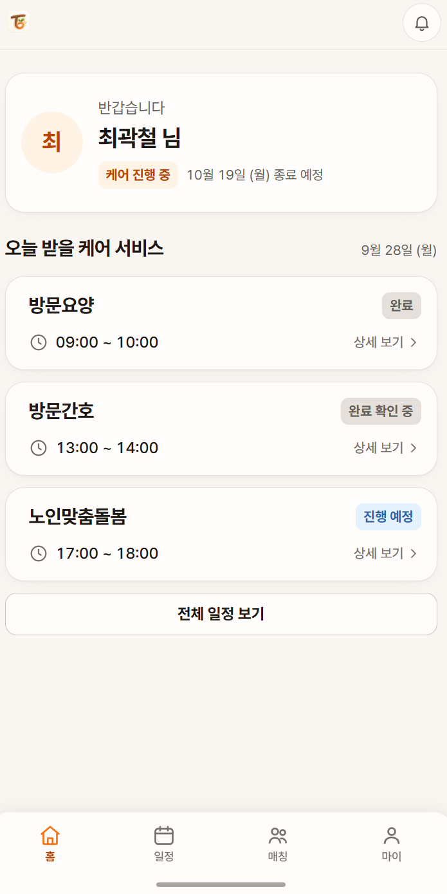 | 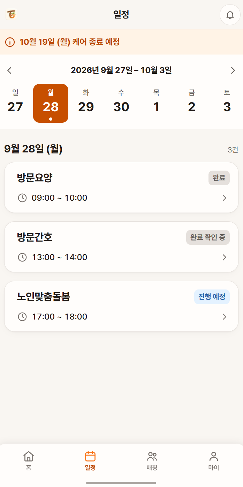 | 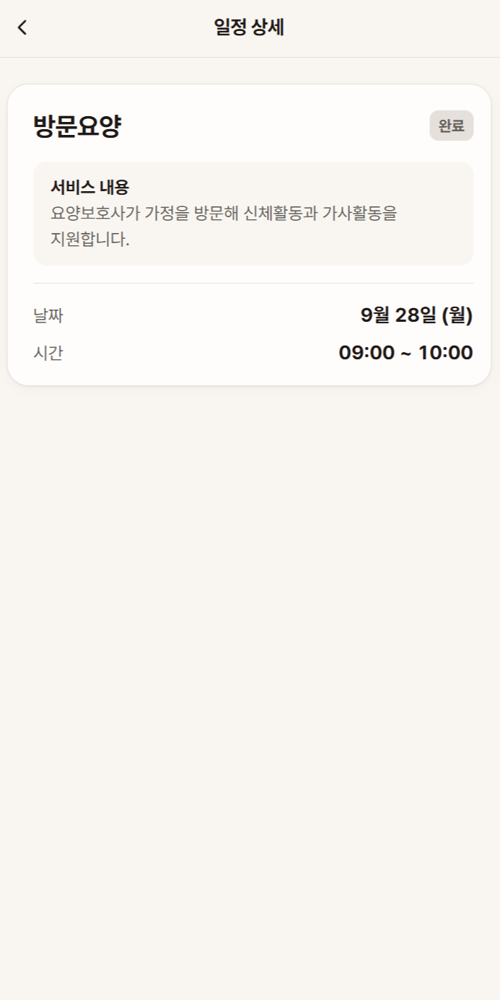 |
| 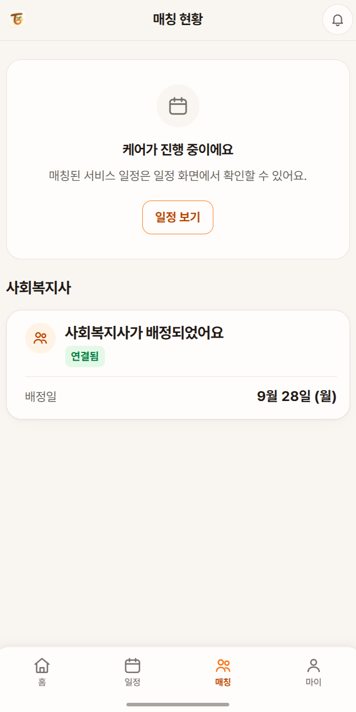 | 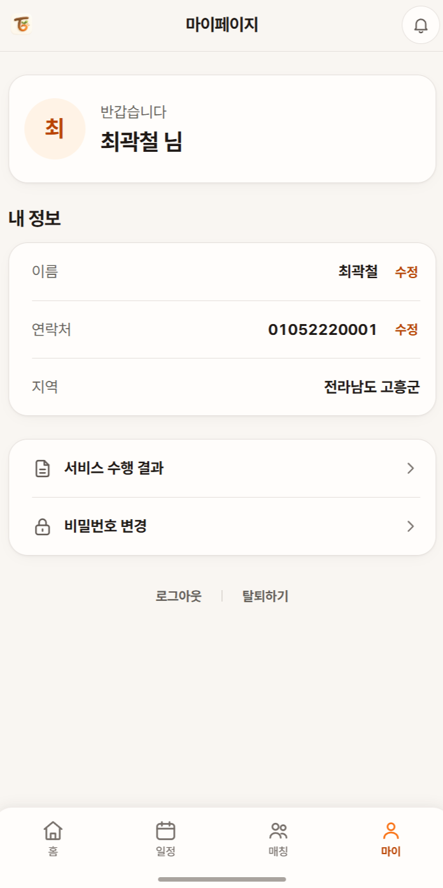 |  |

### 병원 담당자

퇴원 예정자를 등록하고, 실제 퇴원일을 입력해 퇴원을 확정한 뒤 Care Plan을 작성합니다.

```
퇴원 예정자 등록 → 퇴원 처리(실제 퇴원일 입력) → Care Plan 작성 → (퇴원 예정자가 검토·확정)
```

|  |  |
| --- | --- |
| 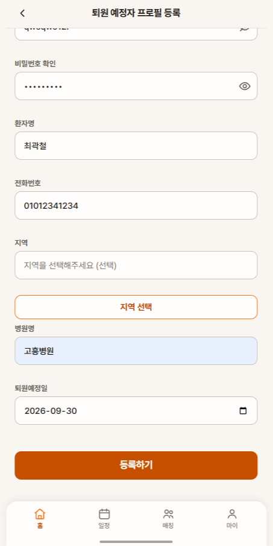 | 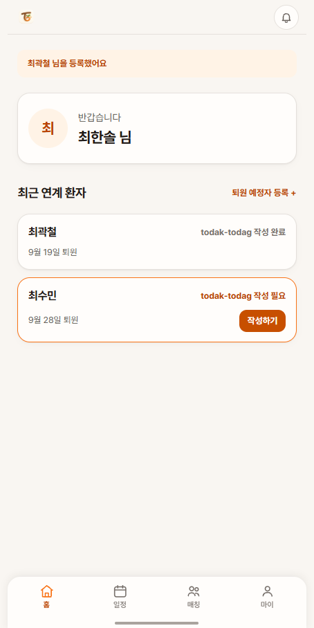 |
| 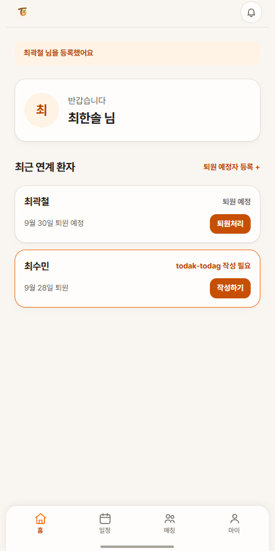 | 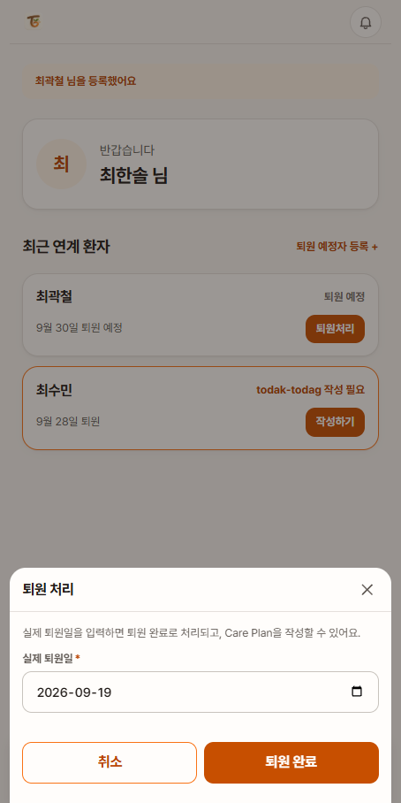 |

### 서비스 제공자

제공 서비스를 등록해야 제공 가능 일정을 만들 수 있고, 일정이 있어야 매칭이 됩니다.

```
제공 서비스 등록 → 제공 가능 요일·시간 등록 → (매칭) → 방문 → 수행 완료 처리 → 수행 결과 작성
```


|  |  |  |
| --- | --- | --- |
| 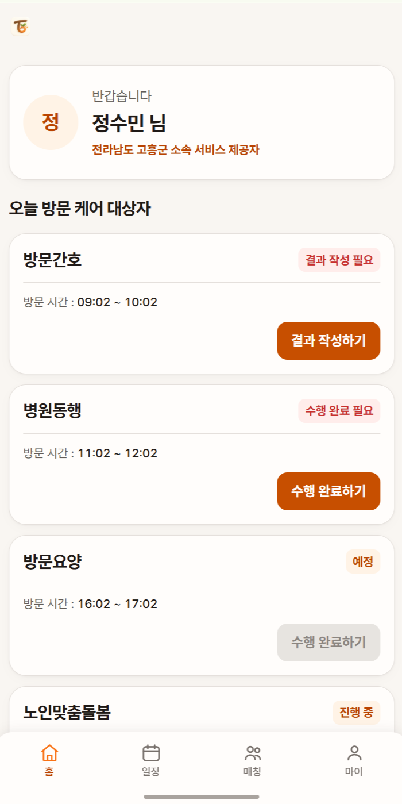 | 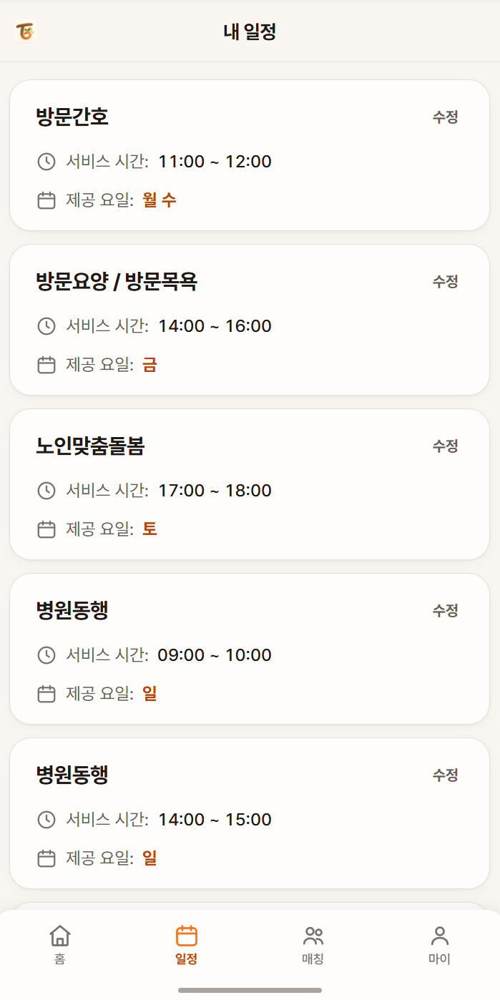 | 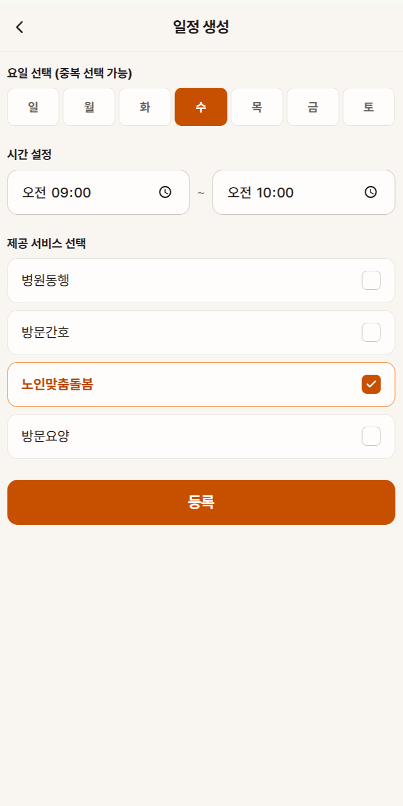 |
| 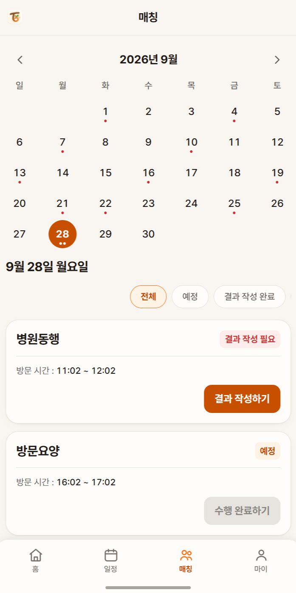 | 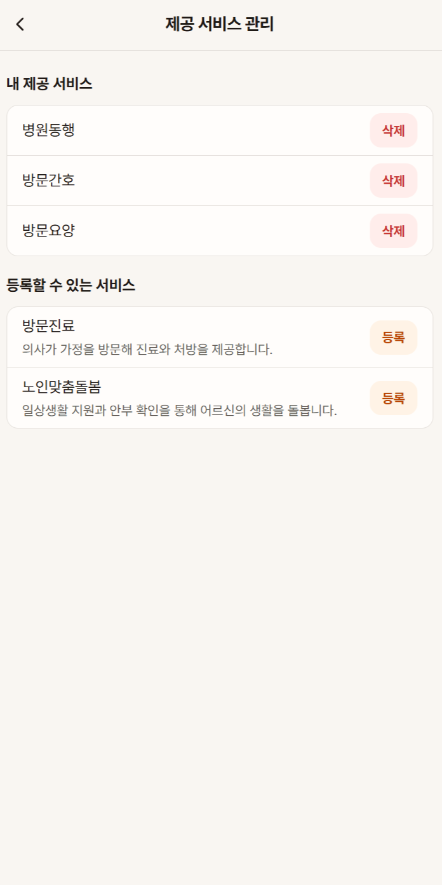 | 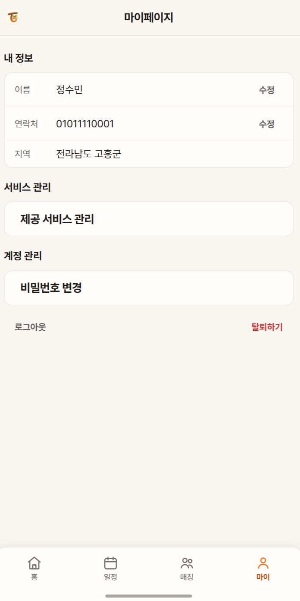 |

<a id="team"></a>

## 팀원 및 역할

| 이름 | 담당 화면 |
| --- | --- |
| [김경민👑](https://github.com/rvbear) | 퇴원 예정자 |
| [최한솔](https://github.com/hansolChoi29) | 사회복지사 |
| [서주성](https://github.com/Seo-JS0823) | 로그인·회원가입, 병원 담당자 |
| [정수민](https://github.com/summmmmmmin) | 서비스 제공자 |
| [원제희](https://github.com/jehee0076) | 배경 디자인 |
